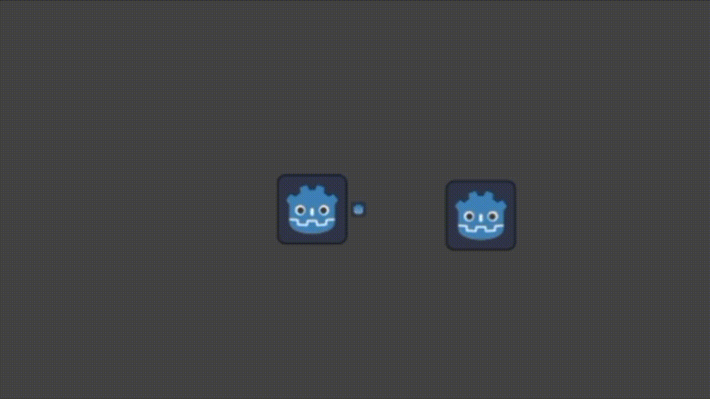

 # Flick Test
Typically in 2D game such as platformers and so, usually only one of the two joysitcks found on a controller are utilized. But what if we were to use both?

This project strives to do so, using not only the left thumbstick for movement, but also the right stick for a game mechanic, called the flick.

This project is made in Godot and coded with GDScript.

Example of the flick at play in v0.0.0 Beta

## How does the flick work?
Glad you asked. The right thumbstick is in charge of controlling whatever item within the game you are holding. When an item is equipped, you have the ability to throw the item at any time by *flicking* the right thumbstick in that direction.

*Note: The flicks controls could be modified in the future.*

# How will the flick be utilized?
The flick turns whatever object you weild into a projectile. From there, you could throw things at other things. Enemies, buttons, puzzles, you name it.

⚠️ *Note: In the future, the flick may not be limitied to just throwing things. More info on that soon to come.*

## Controls

### Basic movement:
1. Move left - "W" key, Left arrow key, left axis on left joystick
2. Move right - "D" key, right arrow key, right axis on left joystick
3. Jump - "A" key, up arrow key, A/Triangle button (Or bottom button equivilant) on controller

### The flick controls:

1. Flick object left - left axis on right joystick
2. Flick object right - right axis on right joystick

#### ⚠️ *Notes*:
*In the future, support for flicking with mouse will be added for users without a controller.*

*In the future, more directions to throw will be added*

*In the future, the flick may have a throwing gage added. Essentially, this should show you your trajectory of your throw. But, this would likeley be implemented with the controls now being inverted as if you were slingshotting.*

*As of now (v0.0.0-beta pre release as of writing this), there isnt much to show other than the flick itself. A map will soon be created with things to do within it where you can properly test this mechanic to your heart's disire.*

## How can I demo this idea?

You can access current builds for the game [here](https://github.com/DanAkrobetu/flickTest/releases). You may also access the source code for the project there as well. 