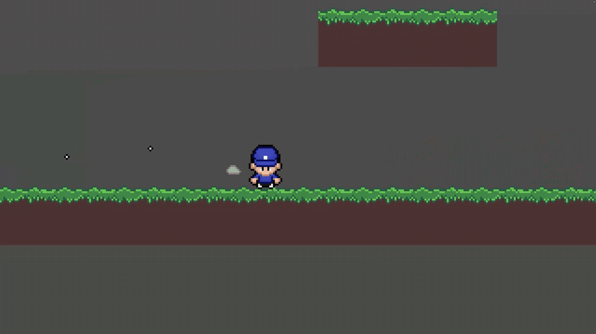

 # Flick Test
Typically in 2D game such as platformers and so, usually only one of the two joysitcks found on a controller are utilized. But what if we were to use both?

This project strives to do so, using not only the left thumbstick for movement, but also the right stick for a game mechanic, called the flick.

This project is made in Godot and coded with GDScript.

Example of the flick at play in v1.1.0

## How does the flick work?
Glad you asked. The right thumbstick is in charge of controlling whatever item within the game you are holding. When an item is equipped, you have the ability to throw the item at any time by *flicking* the right thumbstick in that direction.

# How will the flick be utilized?
The flick turns whatever object you weild into a projectile. From there, you could throw things at other things. Enemies, buttons, puzzles, you name it.

## Controls

### Basic movement:
1. Move left - "W" key, Left arrow key, left axis on left joystick, d-pad left
2. Move right - "D" key, right arrow key, right axis on left joystick, d-pad right
3. Jump - "A" key, up arrow key, up axis on left thumbstick, A/Triangle button (Or bottom button equivilant) on controller or d-pad up

*Also, you have a double jump. Use it.*

### The flick controls:

Use the right thumbstick to gage your throw. When you're ready, hit the right trigger to release.

#### ⚠️ *Notes*:
*In the future, support for flicking with mouse will be added for users without a controller.*

## How can I demo this idea?

You can access current builds for the game [here](https://github.com/DanAkrobetu/flickTest/releases). You may also access the source code for the project there as well. 